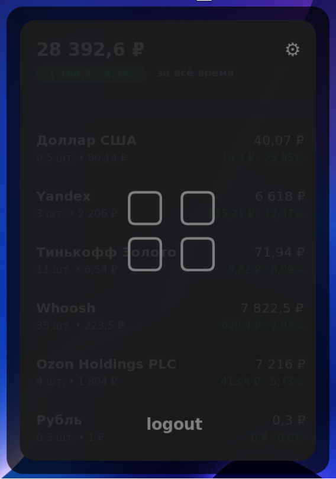

# tinkle
Linux [GTK](https://www.gtk.org/) widget for tracking the status of an investment portfolio in Tinkoff Investments (coursework)

## Installation

### Requirements

- Linux
- GTK+3

To install Python bindings for GTK (PyGObject) follow official [guide](https://pygobject.readthedocs.io/en/latest/getting_started.html)

Clone the repo
```bash
git clone https://github.com/sotchenkov/tinkle
```

Install dependencies
```bash
poetry install
```

And run (to run in the background, you can use [tmux](https://github.com/tmux/tmux/wiki/Getting-Started))
```bash
python3 ./src/main.py
```

## Usage

### Sign in

Get a Tinkoff Investment [Token](https://www.tinkoff.ru/invest/open-api/)

Insert the token into the widget and select the desired portfolio


Now you can use the widget


### Positioning

You can change the position of the widget




It will be moved to the selected corner


You can also minimize it


### Exit

Use `Ctrl+C` to exit the widget